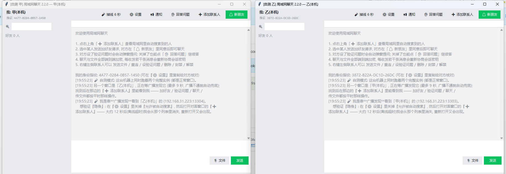
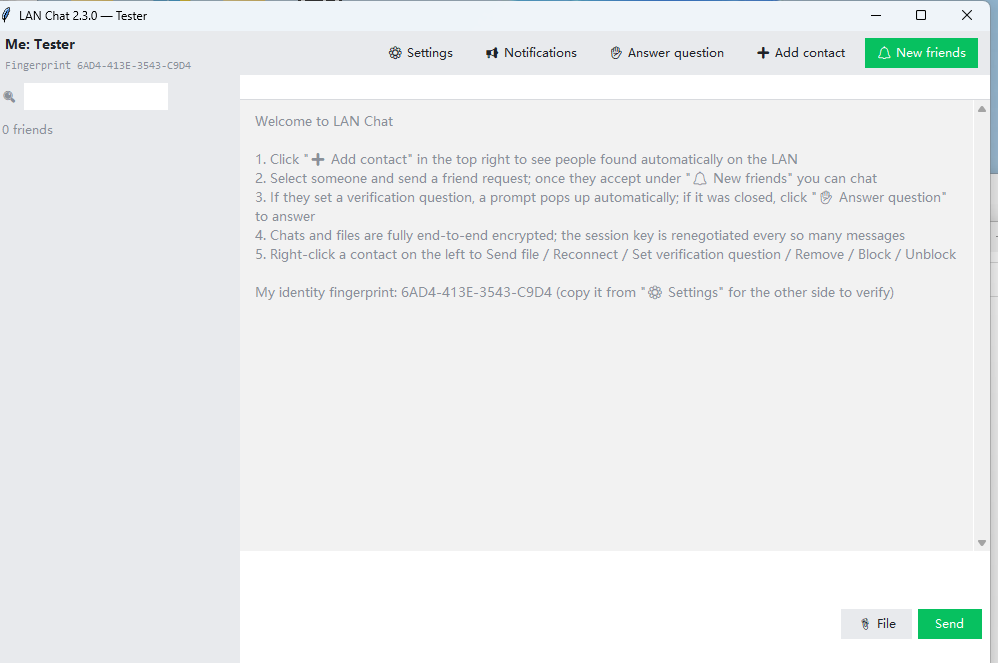

# LanChat —— 局域网即时通讯与文件传输

LanChat 是一款面向局域网（LAN）的点对点通信工具。同一网段内的设备启动后即可相互发现，
无需中心服务器、无需注册账号、无需配对码，直接建立端到端加密的会话，进行文字聊天与文件传输。
消息与文件只在两台终端之间传输，不经过任何第三方节点。

提供 Windows 免安装版本（目标机器无需安装 Python），也可直接从源代码运行。



## 系统要求

| 项目 | 要求 |
| --- | --- |
| 操作系统 | Windows 10 / 11（64 位）。开发与测试均在 Windows 完成；源码中存在 POSIX（macOS / Linux）分支，但未做完整验证 |
| 运行环境 | 免安装版无需任何依赖；源码运行需 Python 3.11 及以上与 `cryptography` |
| 网络 | 各设备位于同一局域网（同一交换机或同一 Wi-Fi 网段）；跨网段需已通过 Tailscale / WireGuard 等完成三层互通 |
| 防火墙 | 首次运行需在 Windows 防火墙提示中允许「专用网络」访问，否则设备之间无法互相发现 |

## 下载与安装

> **版本说明**：预编译的 Windows 免安装包停留在 **2.2.0**，从 **2.3.0** 起仓库只发布源码
> （见 [Releases](../../releases)）。本文档描述的是当前源码（2.3.0），其中的界面语言功能
> 只有方式二才有。

**方式一：使用预编译包（2.2.0，无多语言）**

1. 在 [Releases](../../releases) 页面下载 `LanChat-2.2.0-windows-amd64.zip`
   （约 13.7 MB）。
   > 中国用户如果下载过慢，可以使用 [GitHub 加速](https://gh-proxy.com/)。
2. 将压缩包**完整解压**到任意目录。程序以文件夹形式分发，`LanChat.exe` 依赖同级目录下的
   `_internal\`，请勿单独复制可执行文件。
3. 双击 `LanChat.exe`，填写昵称后即可使用。

**方式二：从源码运行，或自行打包（2.3.0）**

```bash
pip install -r requirements.txt        # 只有 cryptography 一个第三方依赖
python chat_gui.py                     # 直接运行

pyinstaller lanchat.spec --noconfirm --clean   # 或打包成免安装文件夹 → dist\LanChat\
```

> 程序未进行代码签名，Windows SmartScreen 可能提示「未知发布者」；选择「仍要运行」即可。
> 身份密钥与配置保存在数据目录 `%USERPROFILE%\.lanchat`。

## 使用流程

**第一步：添加联系人。** 点击「添加联系人」，列表会显示局域网内已发现的其他设备。
若对方启用了隐身模式，或双方处于广播不可达的组网（Tailscale / WireGuard / 跨网段），
可在同一窗口底部手动填写对方的 `IP`（程序会自动探测其 TCP 端口）或 `IP:端口`。

**第二步：建立好友关系。** 选中设备后发送加好友请求。对方窗口出现「新朋友」提醒，
点击「同意」后双方建立联系人关系。未获同意的设备不能发送任何消息或文件。
如对方设置了验证问题，需先答对问题。

**第三步：通信。** 在左侧选择联系人即可聊天，点击「文件」按钮选择要发送的文件，
接收方确认后开始传输。

## 功能说明

| 功能 | 说明 |
| --- | --- |
| 自动发现 | 同一局域网内自动互相出现，无需填写 IP、无需扫码 |
| 手动添加 | 广播不可达时（跨网段、Tailscale / WireGuard 等）填写对方 `IP`（自动探测端口）或 `IP:端口`；中文冒号、全角数字与多余空格会自动纠正 |
| 文字聊天 | 一对一私聊，以及一键发送给所有在线好友；带未读计数，当前打开的会话不累积未读 |
| 文件传输 | 可指定保存目录、同名文件自动加序号而不覆盖、整文件 SHA256 校验、支持大文件 |
| 好友管理 | 加好友需对方同意、支持验证问题、封禁 / 解禁 / 删除好友（删除会通知对方） |
| 端到端加密 | 每台设备一对长期身份密钥；每次连接现场协商会话密钥，报文使用 AES-256-GCM；每 30 条消息自动轮换密钥，文件传输前后各轮换一次 |
| 隐身模式 | 关闭「允许被自动搜索」后不再广播、不回应探测请求，仅接受对方手动填写 `IP:TCP端口` 发起的连接 |
| 会话记录 | 仅保存在内存中，程序退出即清除，不写入磁盘；一方仍在线时，对端重新上线可获得缺失片段的补发 |
| 界面语言 | 简体中文 / 繁體中文 / English 三种界面语言，首次启动跟随系统语言，可在设置中切换（重启生效），也可用 `--lang` 临时指定 |
| 自测模式 | 单机即可验证全部流程：`--self-test` 打开两个真实窗口，并提供「掉线重连」演练按钮 |

## 界面结构

```
┌──────────────────────────────────────────────────────────────┐
│ 我: 昵称 [设置] [通知] [回答问题] [添加联系人] [新朋友]      │
├───────────┬──────────────────────────────────────────────────┤
│ 好友列表  │ 对话内容 (点「发送」或 Ctrl+Enter)               │
│ (含未读)  │                                                  │
│           │                                                  │
│           │ [输入框]                           [文件] [发送] │
└───────────┴──────────────────────────────────────────────────┘
```

## 界面语言

界面内置三种语言：**简体中文 / 繁體中文 / English**。

* 首次启动跟随 Windows 的系统语言（英文系统直接显示英文，繁体系统显示繁體中文）。
* 之后在「设置」→「界面语言」下拉框中选择，点「应用」保存，**重启程序后生效**。
* 也可以临时指定而不修改设置：命令行加 `--lang`，例如 `LanChat.exe --lang en`。
  语言代码为 `zh-Hans`、`zh-Hant`、`en`。

英文界面：



翻译覆盖图形界面、服务/连接/加密层的用户可见提示，以及 `--diagnose` 自检报告；
代码注释、启动日志与开发文档仍为中文。

## 安全设计与防护措施

LanChat 不使用中心服务器，也不依赖证书颁发机构（CA），信任关系由「设备身份密钥 + 人工核对指纹」建立。
以下按防护目标列出具体实现。

### 1. 身份认证与信任建立

| 防护目标 | 实现方式 |
| --- | --- |
| 设备身份不可伪造 | 每台设备首次启动生成 Ed25519 长期身份密钥。设备标识 `peer_id` 由 Ed25519 公钥的 SHA-256 摘要推导（`lc-` 加 32 位十六进制），无法凭空伪造 |
| 身份人工核对 | 界面提供可读指纹，形如 `AB3F-91C2-77DE-0A55`（即 `peer_id` 前 16 位十六进制，共 64 位）。双方可通过当面、电话等带外渠道比对，以发现中间人 |
| 握手身份证明 | 握手阶段对会话记录摘要（transcript digest）做 Ed25519 签名并校验，证明对端确实持有对应身份私钥 |
| 好友请求防伪造 | 加好友请求携带发送方签名与时间戳，接收方验证通过后才受理 |

### 2. 会话加密与密钥管理

| 防护目标 | 实现方式 |
| --- | --- |
| 密钥协商 | 每次连接现场生成 X25519 临时密钥对并执行 ECDH。会话密钥由 HKDF-SHA256 派生，salt 绑定会话标识与握手摘要，收发两个方向使用相互独立的密钥 |
| 消息加密 | AES-256-GCM。附加认证数据（AAD）绑定会话标识与双方 `peer_id`（按字典序排列），使密文无法被搬运到其他会话或用于冒充其他身份 |
| 前向保密 | 会话密钥来自一次性临时密钥，连接结束即失效。长期身份私钥日后泄露，也无法解密此前的会话内容 |
| 密钥轮换 | 每收发 30 条消息重新协商一次会话密钥，且绝不单方面切换（发起方收到对端回执后才切换）；文件传输开始前后各轮换一次。旧密钥只保留 5 秒宽限期用于处理在途报文，随后销毁 |
| 协议版本校验 | 握手双方协议版本不一致时直接拒绝连接 |

### 3. 抗篡改与抗重放

| 防护目标 | 实现方式 |
| --- | --- |
| 完整性校验 | 解密时校验 GCM 认证标签，失败即判定报文被篡改，丢弃并中断连接 |
| 抗重放 | 96 位随机数由 4 字节随机会话前缀与 8 字节单调计数器组成；接收端维护 4096 条滑动窗口，重复或越界的历史报文一律丢弃 |
| 会话隔离 | 每条连接的会话标识与密钥互不相关，一个会话的密文不能用于另一个会话 |

### 4. 流量分析对抗

| 防护目标 | 实现方式 |
| --- | --- |
| 内容长度混淆 | 发送前按需做 zlib 压缩（仅在体积确实变小时采用，明文需在 48 B–64 KiB 之间），再向上取整到 512 字节的整数倍，并附加 0–511 字节随机填充。报文长度因此不与明文长度形成稳定的对应关系 |
| 分片传输 | 文件按 256 KiB 分片发送。文件分片不做压缩与填充（明文超过 16 KiB 即不再填充），以免影响吞吐 |
| 补发流量打散 | 会话补发分批进行（每批最多 80 条），批间使用随机间隔，避免形成固定模式的大流量特征 |

### 5. 访问控制与数据留存

| 防护目标 | 实现方式 |
| --- | --- |
| 好友关系双向确认 | 未获同意的设备不能发送消息或文件 |
| 验证问题 | 答案经 PBKDF2-HMAC-SHA256（20 万次迭代与随机盐）派生密钥，网络上只传 HMAC 证明，答案本身不传输；每次问答附带随机数以防重放。连续答错达到上限（默认 3 次，可设 1–10 次）自动封禁对方 |
| 封禁与删除 | 可随时封禁、解禁、删除联系人。封禁后拒绝对方全部连接与请求，删除会通知对方 |
| 隐身模式 | 关闭「允许被自动搜索」后不再发送广播、不回应探测请求，只有对端手动填写 `IP:TCP端口` 才能发起连接 |
| 记录不落盘 | 聊天记录仅保存在进程内存中，退出即清除，磁盘上不存在会话记录文件 |
| 记录容量上限 | 每个联系人最多保留最近 500 条，超出后丢弃最早的记录 |
| 补发不降级 | 断线补发的内容使用**当前会话密钥**重新加密，已轮换销毁的旧密钥无法用于解出历史内容 |

### 6. 防护边界（明确不做的事）

* **不隐藏通信事实。** 局域网内的旁观者仍可通过流量分析获知通信双方、通信时段与大致数据量。
  长度混淆只削弱「由报文大小推测内容」的能力，不隐藏通信本身。
* **首次连接依赖带外核对。** 程序采用 TOFU（首次使用即信任）模式。若从未通过其他渠道核对指纹，
  理论上仍存在中间人风险。
* **端点安全优先于协议安全。** 任一端设备被控制、或身份私钥泄露，则该端参与的全部会话均可被读取。
  协议无法防止端点侧的泄露。
* **不支持离线投递。** 不存在服务器，对方离线且本机没有缓存记录时，消息无法送达。
* **二进制未签名。** 可能被杀毒软件或 SmartScreen 误报，可自行从源代码构建。

## 常见问题

| 现象 | 原因与处理 |
| --- | --- |
| 「添加联系人」列表中没有任何设备 | 对方未启动；双方不在同一网段；**防火墙未允许**（首次必须勾选「专用网络」）；对方启用了隐身模式；或双方处于 Tailscale / WireGuard 这类不转发广播的组网 —— 此时请使用手动添加填写对方 IP |
| 已发送加好友请求，对方没有提示 | 请求发送失败时程序会弹窗说明原因；若发送成功，对方需在「新朋友」中点击「同意」 |
| 搜不到对方但知道其 IP | 在「添加联系人」底部填写 `对方IP`（自动探测端口）；对方开启隐身时填写 `对方IP:对方TCP端口` |
| 传输中断或长时间停留在「等待验证」 | 对方已离线（对方上线后会自动重连）；或防火墙拦截了 TCP 连接 |
| 如何确认没有中间人 | 双方打开「设置」核对身份指纹是否一致，并通过其他渠道（当面、电话）确认 |
| 聊天记录会保留吗 | 不会写入磁盘，关闭程序即清除。仅当一方仍在线时，对方重新上线才会收到该段对话的补发 |
| 杀毒软件或 SmartScreen 报警 | 程序没有代码签名，PyInstaller 打包的程序偶尔被误报；可从源代码运行，或按下文说明自行打包 |

## 项目结构

```
lanchat/                核心实现
  discovery.py          UDP 广播发现与网卡枚举
  connection.py         加密连接、密钥轮换、文件传输
  crypto.py             密钥协商、报文加解密、长度混淆
  identity.py           身份密钥、设备标识与指纹
  i18n.py               多语言框架（词条查表、系统语言探测、语言归一化）
  locales/              词条目录：en.py（英语）、zh_hant.py（繁體中文）
  protocol.py           报文编解码
  service.py            会话服务与事件分发
  gui.py                Tkinter 图形界面
  console.py            控制台输出编码处理
  startup_log.py        启动耗时记录与诊断日志
  winfocus.py           窗口置顶与焦点处理
chat_gui.py             图形界面入口
chatgui.py              同名别名入口（不带下划线也能启动）
tools/                  开发工具：i18n_extract.py（抽词条）、i18n_check.py（校验词条目录）
lanchat.spec            PyInstaller 打包配置
使用说明.txt             随发行包分发的简要说明
docs/开发文档.md         设计原理、协议、加密细节与修复记录
```

## 开发与构建

```bash
pip install -r requirements.txt        # 唯一的第三方依赖是 cryptography
python chat_gui.py                     # 启动图形界面
python chatgui.py                      # 同上（省略下划线的别名入口）
python chat_gui.py --self-test         # 单机模拟双端，验证完整流程
python chat_gui.py --diagnose          # 仅执行环境自检，不打开界面
pyinstaller lanchat.spec --noconfirm   # 自行打包，输出到 dist\LanChat\
```

常用命令行参数：

| 参数 | 说明 |
| --- | --- |
| `--name` / `-n` | 昵称，不填写则启动时弹窗询问 |
| `--port` | 本机 TCP 端口，0 表示自动分配（默认） |
| `--discovery-port` | UDP 自动发现端口，默认 50505 |
| `--data-dir` | 身份与好友数据的保存目录 |
| `--download-dir` | 接收文件的保存目录 |
| `--rekey-after` | 每收发多少条消息轮换一次会话密钥，0 表示关闭，默认 30 |
| `--lang` | 指定界面语言：`zh-Hans` / `zh-Hant` / `en`（默认跟随系统语言） |
| `--auto-accept` | 自动接收文件，不逐个询问 |
| `--no-auto-connect` | 不自动连接已添加的好友 |
| `--no-focus` | 不强制将窗口置于最前 |
| `--window-test 秒` | 只显示一个测试窗口，用于确认图形环境是否正常 |
| `--version` | 显示版本号 |

设计原理、协议格式、加密细节与历史修复记录见 [开发文档](docs/开发文档.md)。

## 许可

本项目采用 [MIT](LICENSE) 许可证。
